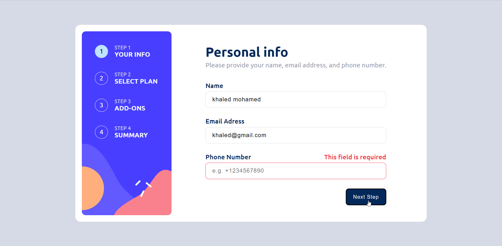
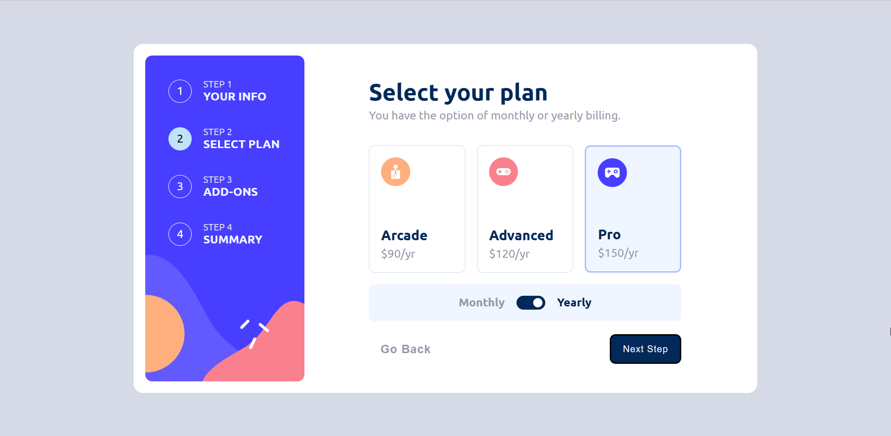
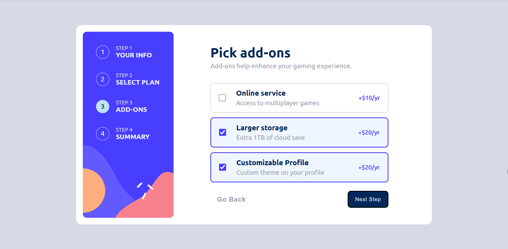
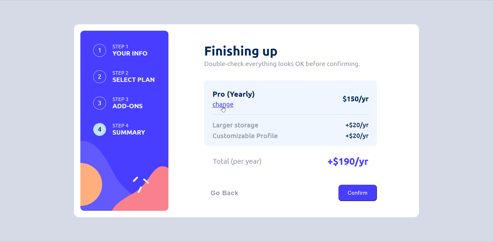
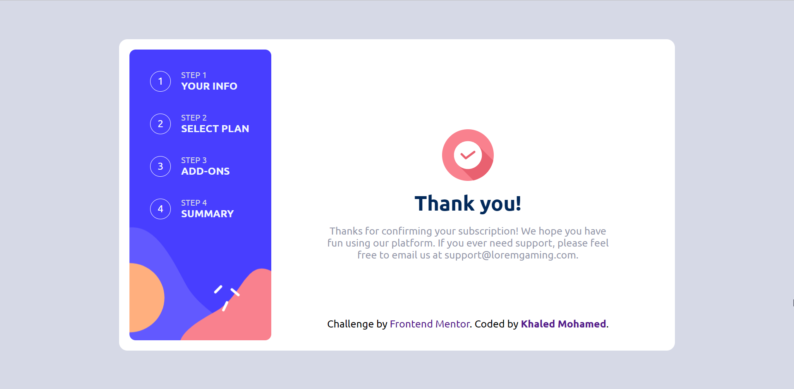

# Frontend Mentor - Multi-step form solution

This is a solution to the [Multi-step form challenge on Frontend Mentor](https://www.frontendmentor.io/challenges/multistep-form-YVAnSdqQBJ). Frontend Mentor challenges help you improve your coding skills by building realistic projects.

## Overview

### The challenge

Users should be able to:

- Complete each step of the sequence
- See a summary of their selections on the final step and confirm their order
- View the optimal layout for the interface depending on their device's screen size
- See hover and focus states for all interactive elements on the page

### Screenshot

### Links

- Solution URL: [solution URL](https://github.com/khaledmasry0/multi-step-validation-form)
- Live Site URL: [multi-step-validation-form](https://khaledmasry0.github.io/multi-step-validation-form/)

## My process

### Built with

- [React](https://reactjs.org/) - JS library
- RedduxToolkit

## Author

- Website - [Khaled Mohamed](https://www.your-site.com)
- Frontend Mentor - [@khaledmasry0](https://www.frontendmentor.io/profile/khaledmasry0)
